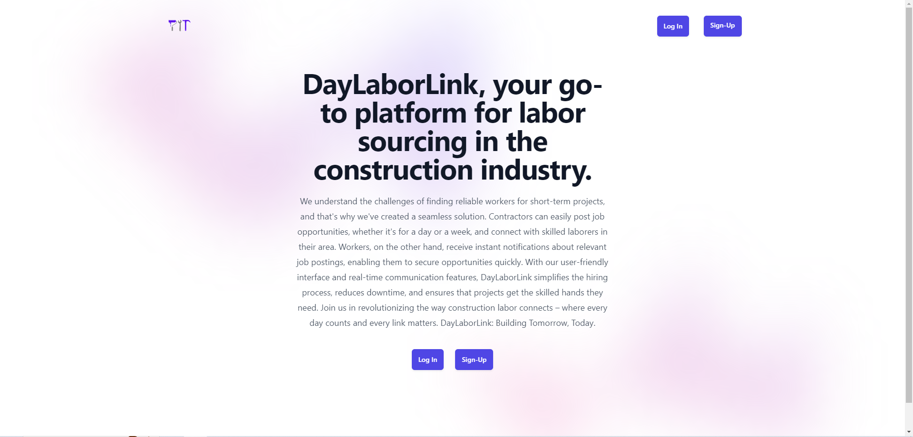

# Install

`npm install`

---

# Things to add

- Create a `.env` file in config folder and add the following as `key = value`
  - PORT = 2121 (can be any port example: 3000)
  - DB_STRING = `your database URI`
  - CLOUD_NAME = `your cloudinary cloud name`
  - API_KEY = `your cloudinary api key`
  - API_SECRET = `your cloudinary api secret`

---

# Run

`npm start`

---

# DayLaborLink

DayLaborLink is a web application designed to efficiently connect employers with available day laborers. Employers can post job opportunities, and day laborers can access and respond to these opportunities, facilitating a streamlined and responsive platform for temporary work assignments.

Link to project: https://daylaborlink-472b8f4f1da3.herokuapp.com/

How It's Made:
Tech used: HTML, CSS, JavaScript

DayLaborLink is a web application designed to streamline the process of connecting employers with day laborers. The platform provides a user-friendly interface built with HTML, CSS, and JavaScript, ensuring a seamless experience for both employers and laborers. The frontend is carefully crafted to be responsive and visually appealing, prioritizing usability and accessibility. To enhance functionality and maintainability, I opted for [Framework of choice], which played a crucial role in structuring and organizing the codebase.

On the backend, the application relies on Node.js and Express.js to handle server-side operations. MongoDB serves as the database, storing crucial information about employers, laborers, and job listings. The interaction between the frontend and backend is facilitated by a RESTful API, ensuring efficient communication and data flow.

Authentication and authorization are implemented to secure user data and provide a personalized experience. JSON Web Tokens (JWT) are used to manage user sessions, enhancing the overall security of the application.

The integration with MongoDB Atlas allows for seamless database management and scalability. However, during the deployment phase on Heroku, I encountered challenges related to IP whitelisting. After configuring the MongoDB Atlas cluster to allow connections from any IP address, the issue was resolved, ensuring that the application could be accessed by users worldwide.

Throughout the development process, I prioritized clean code practices, modular design, and adherence to industry standards. Regular testing and debugging were conducted to identify and resolve potential issues, ensuring a robust and reliable application.

In conclusion, DayLaborLink represents a holistic approach to web development, combining frontend and backend technologies to create a functional, secure, and user-friendly platform. The project showcases my skills in full-stack development, emphasizing my ability to tackle challenges, make informed architectural decisions, and deliver a polished end product.

Current Optimizations:

Localized Feeds for Contractors and Laborers

In an effort to refine the user experience and provide more targeted and relevant information, the application now incorporates localized feeds tailored specifically for contractors and laborers.

For contractors, the optimized feed focuses on presenting a list of available local laborers in the area. This feature streamlines the hiring process, enabling contractors to efficiently browse through potential hires, view their profiles, and make informed decisions.

Conversely, the laborer feed has been fine-tuned to display local job postings created by contractors in the vicinity. This ensures that laborers receive timely and location-specific updates on job opportunities, facilitating a quicker and more effective job search process.

The implementation of these localized feeds not only enhances user satisfaction by delivering content closely aligned with their needs but also fosters a stronger sense of community by connecting local contractors with available laborers and vice versa.

The backend logic has been intricately designed to discern user types and geographic locations, allowing the frontend to dynamically adapt and showcase localized feeds based on the user's profile. This optimization underscores the commitment to providing a personalized and efficient platform that caters to the unique requirements of both contractors and laborers.

Future Optimizations:

Messaging System: Implementing a robust messaging system to facilitate communication between contractors and laborers, enhancing collaboration and coordination.

Location Services: Integrating location-based services to provide real-time information on job postings and available laborers in a specific geographical area, improving the user experience and relevance of content.

Lessons Learned:

Formatting EJS Templates: Crafting dynamic and visually appealing EJS templates presented a challenge that required a deep dive into front-end development. Balancing functionality with aesthetics improved my understanding of template engines and user interface design.

Configuring Routes: Implementing effective routing was a crucial aspect of the project. Navigating the intricacies of Express.js routes and ensuring seamless communication between different components showcased the importance of well-organized and efficient route structures.

Database Connection Setup: Configuring the database connection, especially with MongoDB Atlas, brought its own set of challenges. Overcoming issues related to connection strings, authentication, and data modeling enhanced my skills in database management and interaction.

Heroku Deployment: Deploying the application on Heroku was a significant milestone, but not without its complexities. Addressing issues related to environment variables, database connections in a cloud environment, and ensuring a smooth deployment process underscored the importance of thorough testing and troubleshooting.

Examples:
Take a look at these couple examples that I have in my own portfolio:

Palettable: https://github.com/alecortega/palettable

Twitter Battle: https://github.com/alecortega/twitter-battle

Patch Panel: https://github.com/alecortega/patch-panel